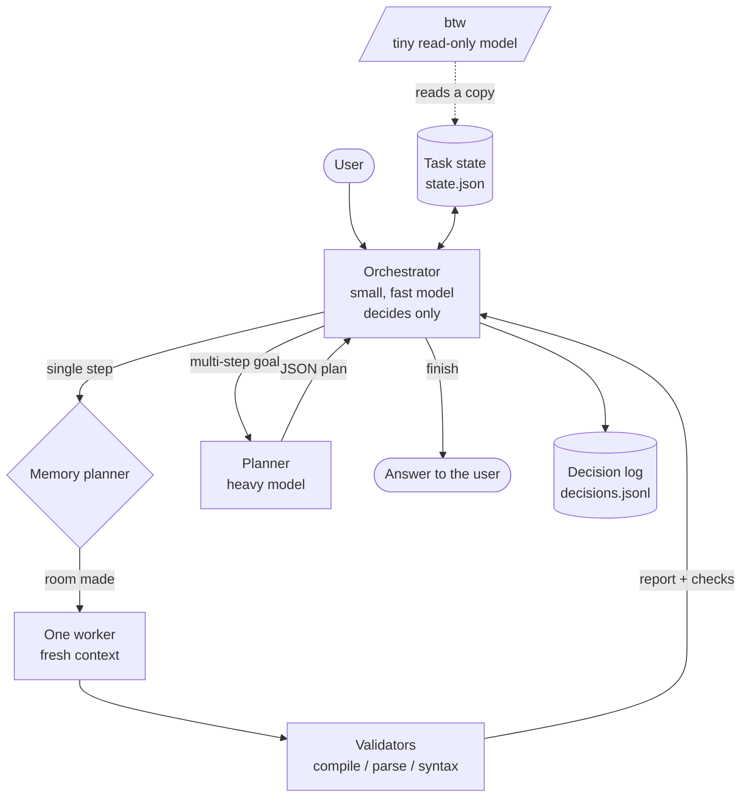
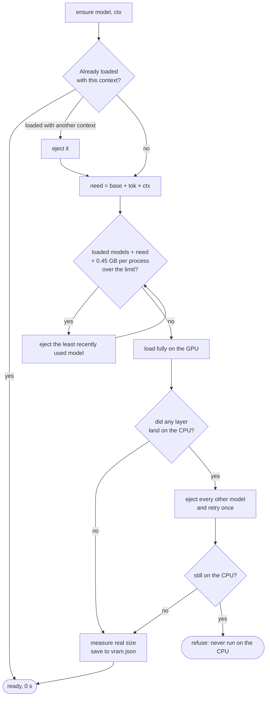
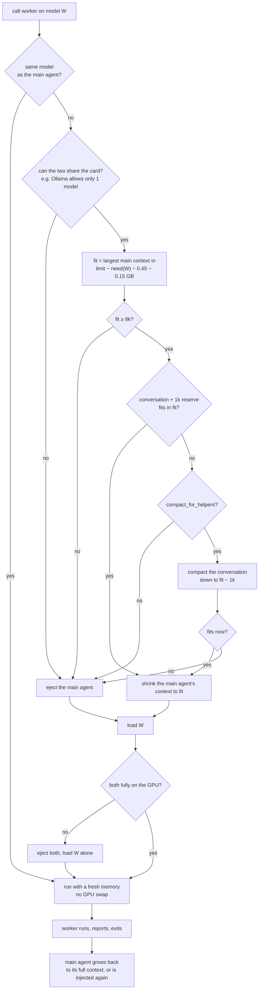
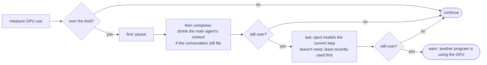
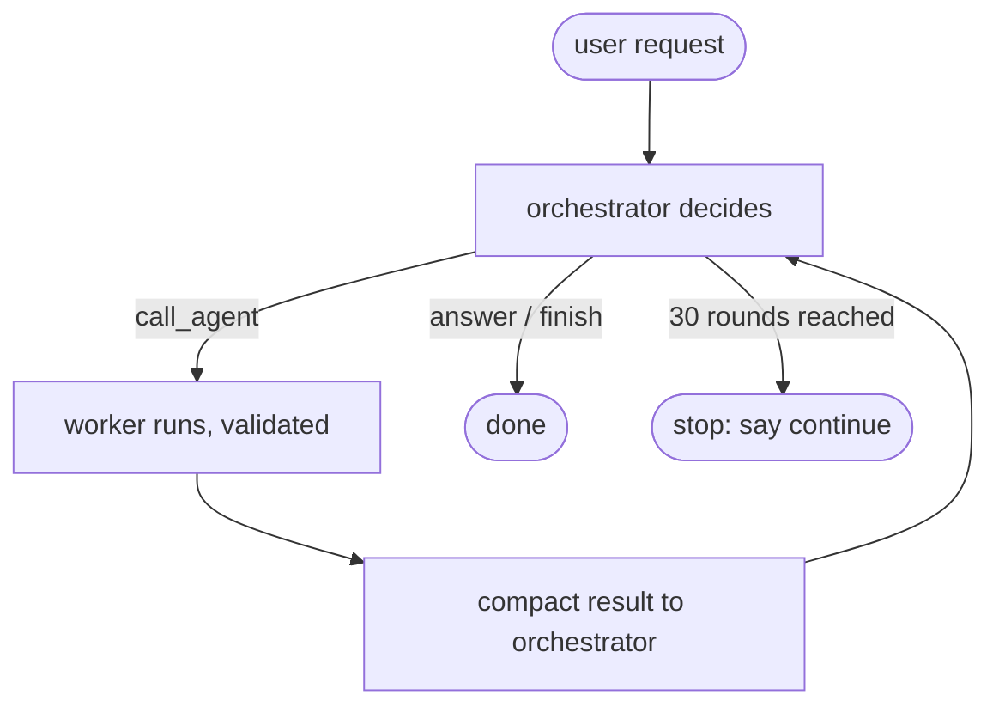
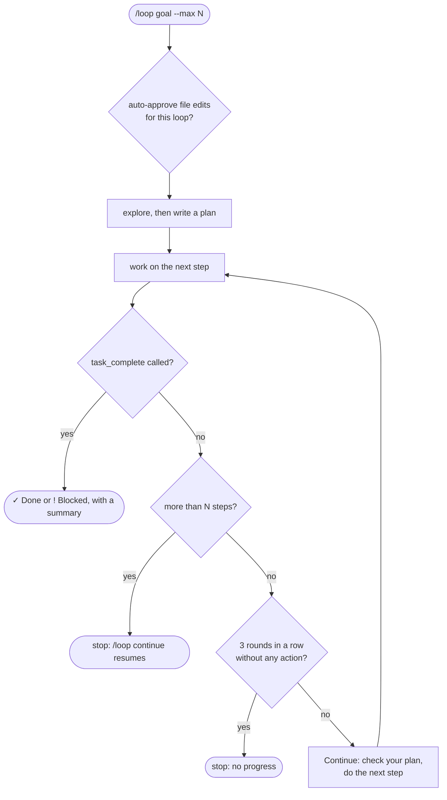

# Chicken design

Chicken is a local AI agent built like an operating-system scheduler, not a chat with many personalities.
A small model decides, one specialist does the work, and GPU memory is planned for every single step.

```text
Orchestrator = scheduler
Task state   = memory
Workers      = processes
Models       = compute backends
Validators   = tests / kernel checks
/btw         = read-only status console
```

Contents:

1. [Core idea](#1-core-idea)
2. [Architecture](#2-architecture)
3. [Models and tiers](#3-models-and-tiers)
4. [GPU memory: the budget and the limit](#4-gpu-memory-the-budget-and-the-limit)
5. [How much memory a model needs](#5-how-much-memory-a-model-needs)
6. [Loading a model: auto-eject](#6-loading-a-model-auto-eject)
7. [Running a worker: shrink, compact, eject, inject](#7-running-a-worker-shrink-compact-eject-inject)
8. [The limit guard](#8-the-limit-guard)
9. [Context compaction](#9-context-compaction)
10. [RAM](#10-ram)
11. [The loops and their limits](#11-the-loops-and-their-limits)
12. [Validation, review and escalation](#12-validation-review-and-escalation)
13. [Task state and contracts](#13-task-state-and-contracts)
14. [Tools and permissions](#14-tools-and-permissions)
15. [/btw: the side channel](#15-btw-the-side-channel)
16. [Modes](#16-modes)
17. [Invariants](#17-invariants)
18. [Learning the router](#18-learning-the-router)
19. [Settings that shape the design](#19-settings-that-shape-the-design)

---

## 1. Core idea

```text
ORCHESTRATOR = observe -> decide
WORKER       = execute -> report -> exit
```

The orchestrator never does the user's work. It reads the request, estimates how complex it is, decides whether it is
one step or many, picks the next worker and its model, launches it, reads the validated result and decides again,
until the task is complete.

Workers never choose the next worker. They do one task, report and exit. Only one worker runs at a time, so it gets
the GPU for itself.

## 2. Architecture



- No parallel workers, no worker-to-worker calls.
- Every worker returns control to the orchestrator.
- Every worker starts with an empty memory and gets only: its task, the files named in it, the previous step's result
  and, optionally, up to 3 relevant sections of the knowledge wikis.
- The memory of the task is structured state on disk, not a model's context. A model can leave the GPU at any time
  without losing anything.

## 3. Models and tiers

Chicken keeps a **capability registry**: for each model, what it is good at, an intelligence level and a speed.
Roles are not tied to models:

```text
helper role != fixed model
```

A role (planner, coder, reviewer, researcher, explorer, vision, summarizer) defines tools and behaviour. The model is
chosen per step: the cheapest one likely to succeed.

| Tier | Used for | Default on a 12 GB GPU |
|---|---|---|
| Orchestrator | Intent, complexity, routing, deciding when the task is done | `qwen3.5:4b` |
| Heavy model | Planning, hard coding and debugging, architecture, difficult reviews, recovery | `bonsai2:27b` |
| Specialists | Coding, vision, OCR, summarization | `qwen2.5-coder:14b`, `gemma3:12b`, `glm-ocr`, `qwen2.5:7b` |
| Trivial tasks | Very short answers | `qwen3.5:2b` |
| Side channel | `/btw` status questions, read-only | `qwen3.5:0.8b` |

The orchestrator is only offered models that are **installed** and **fit fully under the GPU limit on their own**
(at an 8k context). On a smaller card the big models simply disappear from the list; on a bigger one, larger models
can be added to the registry from `config.json` (`"models"`).

Measured on the 12 GB card (GPU memory, weights + context):

| Model | Context | GPU memory |
|---|---|---|
| `bonsai2:27b` | 24k | 7.4 GB |
| `qwen3:14b` | 24k | 11.1 GB |
| `qwen2.5-coder:14b` | 16k | 10.4 GB |
| `gemma3:12b` | 8k | 7.8 GB |
| `deepseek-r1:8b` | 16k | 6.4 GB |
| `qwen2.5:7b` | 8k | 4.9 GB |
| `llama3.2:3b` | 8k | 2.7 GB |
| `glm-ocr` | 4k | 1.9 GB |

## 4. GPU memory: the budget and the limit

GPU memory is a scheduled resource with one number at its centre: the **limit**.

```text
limit = vram_budget_gb          "90%" of the card (default) or a number of GB
```

On a 12 GB card the default limit is about 10.8 GB. The remaining 10% is headroom for the desktop, drivers and other
programs.

```text
 0 GB                                                     limit 10.8      12 GB
 |█████████████████████████████████▓▓▓▓▓▓▓▓▓▓▓▓▓▓▓▓░░░░░░░░░░│░░░░░░░░░░|
  weights of the loaded models     their context cache   free  ^ headroom
```

Three rules apply everywhere:

1. **Everything runs on the GPU.** No model is ever split between GPU and CPU. A model that cannot fit fully with the
   context it needs is not run; a smaller or more quantized one is chosen instead.
2. **Total use stays under the limit.** Before a load Chicken plans for it; after a load it measures the real usage.
3. **Each extra model process costs a fixed overhead** (`PROC_GB` = 0.45 GB of CUDA context) on top of its weights and
   cache. This is counted whenever two models share the card.

`/allocation` shows the plan live: a bar of the card coloured by model (weights + context), memory used by other
programs, the limit marker, free memory under the limit and on the card.

## 5. How much memory a model needs

For every model Chicken builds a memory **profile** from the model's own metadata (Ollama's model info, or the GGUF
file header for llama.cpp servers):

```text
need(model, ctx) = base + tok × ctx

base = weights and buffers (GB)
tok  = context-cache cost per token
     = cache_layers × kv_heads × (key_length + value_length) × bytes_per_element
cache_layers = layers / full_attention_interval      (hybrid models keep a cache in only some layers)
```

- `bytes_per_element` follows the cache type (f16 = 2 bytes, q8_0 ≈ 1, q4_0 ≈ 0.56…).
- Every real load is **measured** and saved in `~/.agent/vram.json`. A measured size corrects `base`, so the estimate
  gets better with use.
- An unknown model gets a cautious guess (8 GB) that is never remembered.

The inverse gives the **largest context that fits** in a given amount of memory:

```text
fit_ctx(model, gb) = (gb − base) / tok      rounded down to a multiple of 1024, capped at the model's maximum
```

This is why **context follows memory** (`num_ctx: "auto"`): a model is not given a fixed context, it is given all the
context its weights leave free under the limit. Bonsai 2 27B, a hybrid model where only 1 layer in 4 keeps a cache,
gets about 57k tokens alone in a 10 GB budget; a classic 14B model gets about 11k.

| Context size | Default | Meaning |
|---|---|---|
| main agent | `auto` | everything that fits under the limit |
| orchestrator | at most 32k (`orchestrator_ctx`) | it only needs goal, plan, state and last result |
| worker | `auto`, at most 64k | or the role's own `context` |
| floor | 8k (`ctx_min`) | the main agent never shrinks below this; below it, it is ejected instead |

## 6. Loading a model: auto-eject

Every model load goes through one function, `ensure(model, ctx)`:



Eviction is **least recently used first**: the model whose last use is oldest leaves first. The output shows each move:

```text
  ⇄ ejected qwen3:14b · loaded qwen2.5-coder:14b (10.4 GB, 16k context) in 4.0s
  ⇄ loaded glm-ocr:latest (1.9 GB, 4k context) in 5.1s · kept bonsai2:27b (fits in the 10.8 GB limit)
```

## 7. Running a worker: shrink, compact, eject, inject

When the orchestrator calls a worker on a different model, Chicken first tries to **keep the main agent in the GPU
beside it**, because reloading it later costs seconds. Only if that is impossible does it eject the main agent and
inject it back afterwards.



A real example, a vision step while the heavy model is the main agent:

```text
  ⇄ chicken context 56k → 25k to make room for vision
  ⇄ loaded glm-ocr:latest (1.9 GB, 4k context) in 5.1s · kept bonsai2:27b (fits in the limit)
  ...the worker runs...
  ⇄ ejected glm-ocr:latest · loaded bonsai2:27b (9.9 GB, 56k context) in 3.0s
```

The step lifecycle, end to end:

```text
orchestrator decides
  -> decision saved in the task state
  -> room made for the worker (shrink -> compact -> eject)
  -> worker loaded fully on the GPU
  -> limit guard (section 8)
  -> worker executes, writes its report
  -> files validated (section 12)
  -> report and checks saved in the task state
  -> worker ejected when its memory is needed
  -> main agent restored to its full context
  -> orchestrator decides the next action
```

## 8. The limit guard

Estimates can be wrong and other programs can take GPU memory at any moment. So after every worker load Chicken
**measures** the real GPU usage and enforces the limit in a fixed order: the cheapest fix first, eviction last.



Models the current step needs are never ejected by the guard. The CPU is never used as an overflow.

## 9. Context compaction

The context is the model's working memory. When it fills up, older messages are **summarized**, not dropped.

| When | What happens |
|---|---|
| Context above 72% full | Automatic compaction before the next model call |
| A worker needs room beside the main agent | Forced compaction down to the size that fits (`compact_for_helpers`) |
| `/compact` | Compaction on demand |

How it works:

1. The most recent part of the conversation (25% of the context) is kept word for word.
2. Everything older is summarized by the model: goals, decisions, files with paths, facts, what is done and what is left.
3. The summary replaces the old messages; the plan is kept separately, so it survives every compaction.
4. If a single exchange is too big to split, long old tool outputs are shortened instead.

The line `↻ context 72% → 26% · auto-compacted` shows each compaction.

Saved conversations are compacted too: on `/load`, outputs that became outdated (a file read later re-read or changed,
repeated searches, files written long ago) are trimmed, which saved 35–50% of memory on real sessions.

## 10. RAM

Models never run in system RAM: Chicken's design keeps all inference on the GPU, so RAM is used only by the program,
the model servers and the operating system's file cache. Chicken **monitors** it rather than budgets it:

- The status line shows RAM used / total while you type and while it works.
- `/allocation` shows total, used and available RAM, the file cache, and the memory of each group of processes:
  Chicken itself, Ollama (models + server) and the llama.cpp servers.

```text
  GPU  9.6 of 12.0 GB used · limit 90% = 10.8 GB
  ██████████████████████████████████████▒▒░░░░░│░░░░  │ = limit
  ■ bonsai2:27b             7.4 GB  worker · weights 5.9 + context 1.5 · 24k tokens
  ■ qwen3.5:0.8b            1.2 GB  /btw · weights 0.8 + context 0.4 · 4k tokens
  ▒ other programs 1.0 GB · free under the limit 1.2 GB · free on the card 2.4 GB
  RAM  6.1 of 32.0 GB used · 25.9 GB available · file cache 9.3 GB
    Chicken                      0.2 GB
    Ollama (models + server)     0.6 GB
    llama.cpp servers            0.9 GB
```

(Illustrative values.)

## 11. The loops and their limits

Chicken works in loops, and every loop has a hard ceiling so that nothing can run away or hold the GPU forever.

### The orchestration loop (one request)



- Up to `max_tool_rounds` (30) decisions per request. Then Chicken stops and waits: "continue" lets it go on.
- Every answer, reasoning included, is capped at `max_answer_tokens` (8192) tokens.
- Every shell command is killed after `command_timeout` (300 s).

### The refinement loop (worker, check, fix)

Output gets better through repeated, checked passes, never through one long unchecked answer:

```text
worker writes  ->  validators check  ->  orchestrator reads report + checks
                                            |
           +--------------------------------+--------------------------------+
           |                                |                                |
   status done, checks ok          needs_review / failed              blocked twice /
           |                                |                         failed twice
      next step or finish        same worker again, or the                  |
                                 reviewer, with what to fix         escalate to the
                                                                       heavy model
```

- A reviewer worker can be called after a change; its findings go back to the coder as the next task.
- Each pass is one decision of the orchestration loop, so the refinement is bounded by the same 30 rounds per request
  (or by N steps in autonomous mode, below).
- After **2 failures or blocks of the same role** in a task, Chicken tells the orchestrator to escalate to the heavy model.

### The autonomous loop: `/loop <goal> [--max N]`



- **N** is the maximum number of model calls: `--max N`, default `loop_max_steps` = 80.
- It stops on its own when the goal is done or blocked, at the step limit, or after 3 rounds without progress.
- It asks once whether to auto-approve file edits; moves, deletions and commands still ask.
- The plan survives compaction, and the conversation is autosaved after every step; `/loop continue` resumes.

## 12. Validation, review and escalation

Software checks what software can check exactly. Every file a worker changed is validated before the orchestrator
sees the result:

| File | Check |
|---|---|
| `.py` | must compile |
| `.json` | must parse |
| `.sh`, `.bash` | must pass `bash -n` |

A failed check turns a `done` step into `needs_review`, and the orchestrator sees the exact error:

```text
└ ! coder  21s · Created hello.py
    ✗ hello.py '(' was never closed (hello.py, line 1)
```

The orchestrator escalates to the heavy model when the plan is unclear, a worker fails or is blocked twice, the work
is hard coding, debugging or architecture, results contradict each other, a big change needs review, or the user asks
for the highest quality.

## 13. Task state and contracts

Each request gets a run folder, `~/.agent/runs/<id>/`, with the authoritative state and one card per step:

```text
runs/<id>/state.json             goal, mode, plan with step status and model, artifacts, last result, errors, calls
runs/<id>/step-01-planner.md     the task exactly as the worker received it
runs/<id>/step-01-planner.result.md
runs/<id>/step-02-coder.md
...
```

```json
{
  "goal": "Build application X",
  "mode": "auto",
  "status": "running",
  "plan": [
    { "id": 1, "task": "design architecture", "status": "done",    "role": "planner", "assigned_model": "bonsai2:27b" },
    { "id": 2, "task": "implement backend",   "status": "running", "role": "coder",   "assigned_model": "qwen2.5-coder:14b" },
    { "id": 3, "task": "implement frontend",  "status": "pending", "role": "coder" }
  ],
  "artifacts": ["src/server.py", "src/api.py"],
  "last_result": { "agent": "coder", "status": "done", "summary": "Implemented REST API" },
  "errors": [],
  "fails": {}
}
```

**Orchestrator decision** (through its only tools, `call_agent` and `update_plan`): role, model, a stand-alone task,
the reason, the complexity (`trivial`, `low`, `medium`, `high`, `frontier`) and the plan step.

**Planner output:** an ordered list of steps with description, required capabilities, preferred role and
dependencies. The planner never executes the plan.

**Worker report:**

```json
{
  "status": "done",
  "summary": "Implemented authentication module.",
  "artifacts": ["src/auth.py", "tests/test_auth.py"],
  "important_facts": ["Uses JWT", "Tests pass"],
  "blocked_by": null,
  "errors": [],
  "suggested_followup": null
}
```

Statuses: `done`, `partial`, `blocked`, `failed`, `needs_review`. The orchestrator reads a compact version; the full
report stays in the run folder. A suggested follow-up is never binding.

## 14. Tools and permissions

| Role | Tools |
|---|---|
| orchestrator | `call_agent`, `update_plan` only |
| explorer | read, list, find, search in files |
| researcher | read, web search, fetch URL |
| reviewer | read, run command |
| coder | read, write, edit, make dir, move, delete, run command |
| vision, summarizer, planner | none: the program gives them their input and applies their answer |
| /btw | a read-only copy of the task state |

Workers that can't call tools reliably run as **writers**: Chicken hands them the files and applies their answer with
the same diff and approval as any other change.

Safety, enforced in code:

- Files can only be touched inside `root` (the home folder by default); key folders (`~/.ssh`, `~/.gnupg`) and
  Chicken's own config can never be modified.
- Every change shows a diff with line numbers and asks first (unless the user allowed that kind of action).
- Deleted files go to `~/.agent/trash/`, never destroyed.

## 15. /btw: the side channel

`/btw <question>` asks about the running task: what is working now, why a model was chosen, what step 3 is, which
files changed, what happens next.

- A tiny model on its own llama.cpp server (4k context) answers from a **copy** of the task state and the most recent
  part of the conversation, even while a worker runs.
- It starts only if it fits: `used + need + 0.45 GB ≤ limit`. If the GPU is full, it says so instead of evicting the
  worker. It stays loaded while there is room.
- Its answers are capped at 600 tokens. It is outside the orchestration loop and can never change the state, the plan,
  the models or any file.

## 16. Modes

| `/mode` | Behaviour |
|---|---|
| `ask` | Confirm each worker (Yes · Yes for the session · No, or `/model <name>` / `/role <name>` to change it) and each change |
| `auto` | No confirmations for workers or actions |
| `orchestrator` | Default routing: the small model only decides |
| `bonsai-only` | The heavy model is the orchestrator and every worker: maximum quality, and a baseline |
| `bonsai-workers` | The small orchestrator stays, every worker runs on the heavy model: separates routing quality from worker quality |
| `classic` | No orchestrator: the main model works itself with all tools and calls helpers |

## 17. Invariants

Enforced in code, not only in prompts:

1. All inference runs on the GPU. No CPU inference, no CPU layer offload.
2. A model must fit fully in GPU memory under the limit, or it is not eligible.
3. At most one worker is active at a time.
4. Only the orchestrator can call a worker. Workers cannot call agents.
5. Workers exit after returning their report; the orchestrator regains control after every worker.
6. The planner does not execute the plan; the orchestrator does not do the user's work.
7. The external task state is authoritative; model contexts are disposable.
8. `/btw` is read-only and never evicts a worker.
9. Every loop has a ceiling: rounds per request, steps per `/loop`, tokens per answer, seconds per command.

## 18. Learning the router

Every orchestration decision is appended to `~/.agent/logs/decisions.jsonl` with its outcome: goal, mode,
role, model, reason, complexity, step, status, time and failed validations. These logs become the dataset to fine-tune the
orchestrator on the user's own set of models, so routing improves with use.

## 19. Settings that shape the design

All in `~/.agent/config.json`:

| Key | Default | Role in the design |
|---|---|---|
| `model` | `qwen3.5:4b` | the orchestrator |
| `heavy_model` | `bonsai2:27b` | planner, escalation target |
| `btw_model` | `qwen3.5:0.8b` | the side channel |
| `models` | `{}` | extra models for the registry |
| `servers` | Bonsai, 2B, 0.8B | models served by llama.cpp, started and stopped by Chicken |
| `vram_budget_gb` | `"90%"` | the GPU limit |
| `num_ctx` | `"auto"` | context follows memory |
| `ctx_min` | `8192` | floor before ejecting the main agent |
| `orchestrator_ctx` | `32768` | ceiling for the orchestrator's context |
| `compact_for_helpers` | `true` | compact to keep the main agent beside a worker |
| `max_tool_rounds` | `30` | decisions per request |
| `loop_max_steps` | `80` | default N for `/loop` |
| `max_answer_tokens` | `8192` | tokens per answer |
| `command_timeout` | `300` | seconds per command |

The design philosophy, in one line each:

```text
small orchestrator decides
specialist executes
heavy model handles hard problems
worker exits
orchestrator resumes
memory is planned before every step
```

This stays true whatever models or GPU are used.

---

Copyright 2026 alemarzosw. This document is licensed under the
[Creative Commons Attribution 4.0 International License](LICENSE).
If you reuse or adapt it, credit alemarzosw and link to https://github.com/alemarzosw/Chicken.
