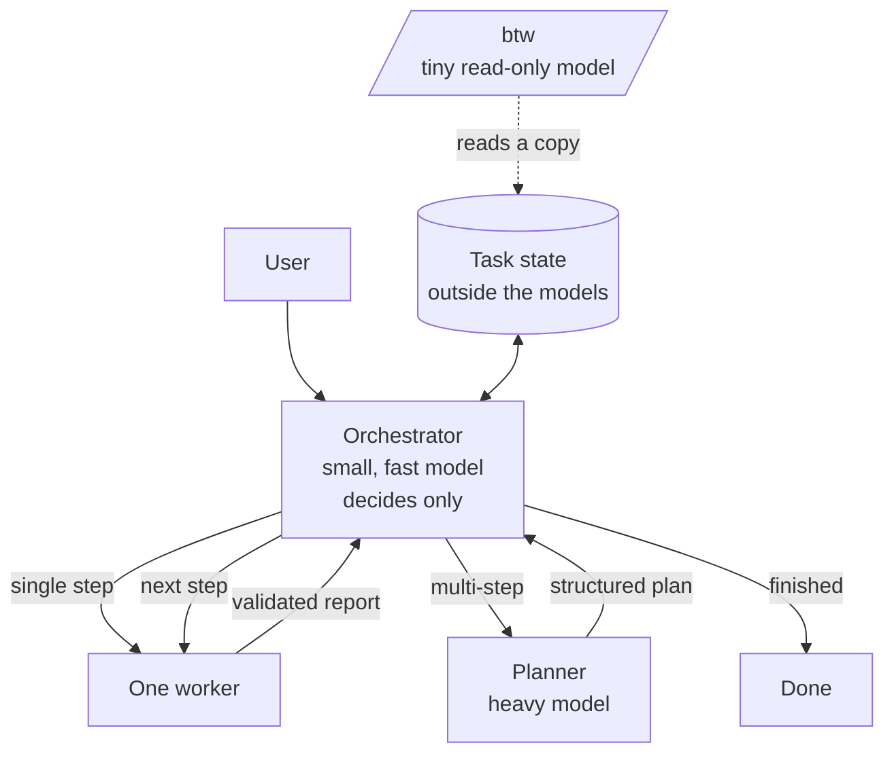

# Chicken: design

Chicken is a local AI agent built like an operating-system scheduler rather than a chat with many personalities.
A small model decides, one specialist does the work, and the GPU memory is managed for every step.

```text
Orchestrator = scheduler
Task state   = memory
Workers      = processes
Models       = compute backends
Validators   = tests / kernel checks
/btw         = read-only status console
```

## 1. Core idea

```text
ORCHESTRATOR = observe -> decide
WORKER       = execute -> report -> exit
```

The orchestrator never does the user's work. It reads the request, estimates how complex it is, decides whether it is
one step or many, picks the next worker and its model, launches it, reads the result and decides again, until the
task is complete.

Workers never choose the next worker. They do one task, report and exit.

## 2. Architecture



- No parallel workers, no worker-to-worker calls.
- Every worker returns control to the orchestrator.
- Every worker starts with a fresh context.
- The memory of the task is structured state on disk, not a model's context.

## 3. Model tiers

Chicken does not hard-wire roles to models. It keeps a **capability registry** and picks the cheapest model that is
likely to succeed.

| Tier | Used for |
|---|---|
| Orchestrator | Intent, complexity, routing, deciding when the task is done. Small and fast. |
| Heavy model | Planning, hard coding and debugging, architecture, difficult reviews, recovery after failures. |
| Specialists | Coding, vision, OCR, summarization and other focused jobs. |
| Side-channel | `/btw` status questions. Very small, read-only. |

Each model in the registry declares its capabilities, an intelligence level, a speed and a memory cost.
The orchestrator chooses from: required capabilities, expected difficulty, model intelligence, latency, memory
available and the current mode.

```text
helper role != fixed model
```

A role (coder, reviewer, researcher, explorer, vision, summarizer, planner) defines tools and behaviour.
The model is chosen per step.

## 4. Memory management

GPU memory is a scheduled resource.

**Everything runs on the GPU.** A model is never split between GPU and CPU. If a model cannot fit fully with the
context it needs, it is not eligible, and a smaller or more quantized model is chosen instead.

**A memory limit.** Chicken keeps total GPU use under a configurable share of the card. After every load it measures the
real usage. Above the limit it, in order:

1. pauses,
2. shrinks the context of the models that stay,
3. compacts the conversation if it no longer fits the smaller context,
4. ejects the models the current step doesn't need, least recently used first.

**Context follows memory.** A model's context is not a fixed number: it is whatever memory its weights leave free.
Chicken reads each model's size and per-token context cost from its metadata, corrects them with measured values, and
gives the model all the context that fits. When a worker needs room, the main agent's context shrinks to make space
beside it, and grows back as soon as the worker leaves.

**The step lifecycle:**

```text
orchestrator decides
  -> decision saved to the task state
  -> memory made for the worker (shrink, compact or eject)
  -> worker loaded fully on the GPU
  -> worker executes and reports
  -> report saved to the task state
  -> worker ejected
  -> orchestrator restored, decides the next action
```

## 5. Task state

The task state is authoritative. Model contexts are disposable.

```json
{
  "task_id": "task_001",
  "mode": "auto",
  "goal": "Build application X",
  "status": "running",
  "plan": [
    { "id": 1, "task": "design architecture", "status": "done",    "role": "planner" },
    { "id": 2, "task": "implement backend",   "status": "running", "role": "coder" },
    { "id": 3, "task": "implement frontend",  "status": "pending" }
  ],
  "artifacts": ["src/server.py", "src/api.py"],
  "last_result": { "agent": "coder", "status": "done", "summary": "Implemented REST API" },
  "errors": [],
  "notes": []
}
```

Each orchestration turn receives only what it needs: the goal, the plan, the state, the last worker result, the
available models and agents, and the mode. Full worker transcripts are stored separately for debugging.

## 6. Contracts

### Orchestrator decision

```json
{
  "decision": "call_agent",
  "reason": "Task requires multi-step planning",
  "task_complexity": "high",
  "task_type": "multi_step",
  "selected_role": "planner",
  "selected_model": "<from the registry>",
  "worker_task": "Create a step-by-step plan for the user goal.",
  "requires_confirmation": false,
  "confidence": 0.93
}
```

Decisions: `call_agent`, `ask_user`, `finish`, `retry`, `escalate`.
Complexity: `trivial`, `low`, `medium`, `high`, `frontier`.

### Planner

The planner returns an ordered list of steps (description, required capabilities, preferred role, dependencies,
success criteria) and exits. It never executes the plan.

### Worker report

```json
{
  "status": "done",
  "summary": "Implemented authentication module.",
  "artifacts": ["src/auth.py", "tests/test_auth.py"],
  "important_facts": ["Uses JWT", "Tests pass"],
  "blocked_by": null,
  "errors": [],
  "suggested_followup": null
}
```

Statuses: `done`, `partial`, `blocked`, `failed`, `needs_review`.
A suggested follow-up is only a suggestion: the orchestrator decides.

## 7. Tools by role

The orchestrator has as few tools as possible: `call_agent` and `update_plan`. It never writes files, browses the web
or runs commands.

| Role | Tools |
|---|---|
| explorer | read, list, find, search in files |
| researcher | read, web search, fetch URL |
| reviewer | read, run command |
| coder | read, write, edit, make dir, move, delete, run command |
| vision, summarizer, planner | none: the program gives them their input and applies their answer |
| /btw | read-only snapshot of the task state |

Workers that cannot use tools reliably are run as **writers**: the program hands them the files and applies their
answer, with the same diff and approval as any other change.

## 8. Validation and escalation

Software checks what software can check exactly. Every file a worker changes is validated: code must compile or parse,
JSON must match its schema, scripts must pass a syntax check, expected artifacts must exist. A failure turns the step
into `needs_review` and goes back to the orchestrator.

```text
worker -> validator -> PASS -> orchestrator
                    -> FAIL -> orchestrator -> repair worker / heavy model
```

The orchestrator escalates to the heavy model when the plan is unclear, a worker fails twice or is blocked,
confidence is low, the work is hard coding or architecture, results contradict each other, or the user asks for the
highest quality.

## 9. Modes

| Mode | Behaviour |
|---|---|
| `ask` | The orchestrator proposes each worker and model; the user confirms, cancels or overrides. |
| `auto` | Decisions run without confirmation. |
| `heavy-only` | The heavy model is orchestrator and every worker. Maximum quality, and a baseline. |
| `heavy-workers` | The small orchestrator stays; every worker runs on the heavy model. Separates routing quality from worker quality. |

In `ask` mode the proposal looks like this:

```text
▸ coder  Create hello.py printing hello
    low · step 1 · coding step
  Run?  1. Yes  2. Yes for the session  3. No   (or /model <name>, /role <name>)
```

## 10. `/btw`: the side channel

`/btw <question>` asks about the running task: what is working now, why a model was chosen, what step 3 is, which
files changed, what happens next. A very small model answers from a **copy** of the task state, even while a worker
runs. It is outside the orchestration loop and can never change the state, the plan, the models or any file.

## 11. Invariants

These are enforced in code, not only in prompts.

1. All inference runs on the GPU. No CPU inference, no CPU layer offload.
2. A model must fit fully in GPU memory, or it is not eligible.
3. At most one worker is active at a time.
4. Only the orchestrator can call a worker. Workers cannot call agents.
5. Workers exit after returning their report.
6. The orchestrator regains control after every worker.
7. The planner does not execute the plan; the orchestrator does not do the user's work.
8. The external task state is authoritative.
9. `/btw` is read-only and cannot advance the task.
10. `ask` mode confirms before every worker; `auto` mode only stops when the user's input is truly needed.

## 12. Learning the router

Every orchestration decision is logged with its outcome (success, retries, time). These logs become the dataset to
fine-tune the orchestrator on the user's own set of models, so routing improves with use.

Per worker call Chicken tracks model, role, step, latency, tokens, memory used, success, retries, validator result and
user overrides. Per task it tracks total time, worker calls, heavy-model calls, failures, confirmations and tokens.

## 13. Design philosophy

The intelligence comes from routing, specialization, fresh contexts, deterministic validators, controlled escalation
and external state, not from letting every model do everything.

```text
small orchestrator decides
specialist executes
heavy model handles hard problems
worker exits
orchestrator resumes
```

This stays true whatever models are added later.

---

Copyright 2026 alemarzosw. This document is licensed under the
[Creative Commons Attribution 4.0 International License](LICENSE).
If you reuse or adapt it, credit alemarzosw and link to https://github.com/alemarzosw/Chicken.
